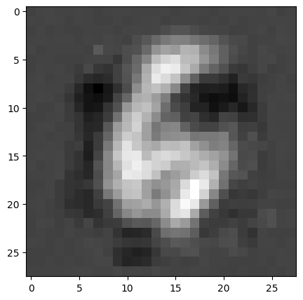

# 🗓️ Day 1 of Neural Network aday Challenge 
## MNIST Autoencoder

🎯 Implement torch model that does autoencoding on MNIST dataset.

🛠️ Model Arch

📊 Dataset:

    MNIST from Yann Lecun

🔢 Results:

Terrible, but goal was to implement it for now.

    Accuracy: XX.XX%
    Loss: X.XXX
    Epochs: X

Example output after 10 epochs (±a minute of training)

Training Curve: (Optional, insert training loss/accuracy plot here)

🧩 Key Learnings:

    - Better understanding of torch library
    - Discovery of the torchview library
    - Understanding of the difference between ReLU which seems to fail to increase brightness of the dark values:

⚠️ Challenges Faced:

    Understanding the formatting of the images was tough. Seems that "from_bytes" for Pillow didn't want to take in the bytes, it was hard to find information about the decoder name to pass. Used ChatGPT to get better results.

🛠️ Improvements for Tomorrow

    Optimize to get better results.