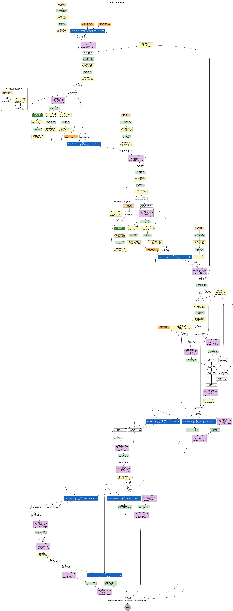

# MNIST using JAX

🎯 Implement JAX model based on https://colab.research.google.com/github/vincentadam87/intro_to_jax/blob/main/notebooks/Mnist%20Classification%20with%20Neural%20Networks%20-%20from%20scratch%20with%20JAX.ipynb#scrollTo=60823b3b

🛠️ Model Arch

📊 Dataset:

    MNIST from Yann Lecun

🔢 Results:

Not understandable. The training score isn't going any higher.

    Accuracy: XX.XX%
    Loss: X.XXX
    Epochs: X

<!-- Training Curve: (Optional, insert training loss/accuracy plot here) -->

🧩 Key Learnings:

    - JAX seems to be optimized for trainging and I would be curious to then setup some serious logging and compare the three frameworks based on similar setups.

⚠️ Challenges Faced:

    A few package dependency issues, and not being able to understand why the model wasn't converging. Probably a me problem.

🛠️ Improvements for Tomorrow

    Do some logging to compare the three frameworks ?