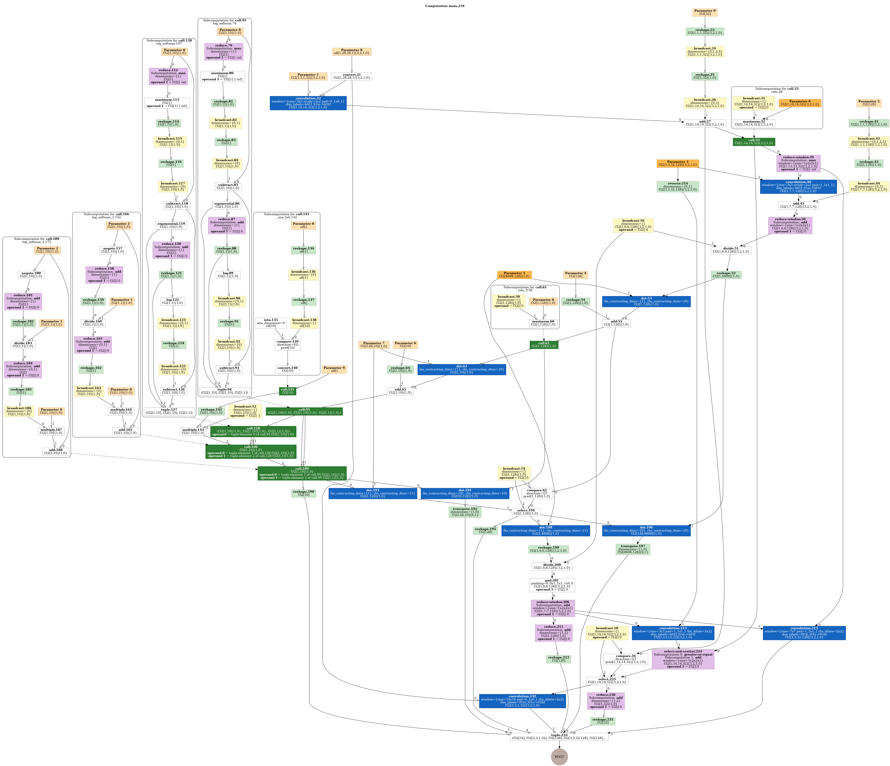

# MNIST using JAX 2nd Attempt

🎯 Implement JAX model based on https://medium.com/@micky.multani/decoding-neural-networks-with-jax-from-untrained-to-trained-b148a48d87ff

🛠️ Model Arch

📊 Dataset:

    MNIST from Yann Lecun

🔢 Results:

Not understandable. The training score isn't going any higher.

    Cross Entropy Loss: ±0.4, which means that the correct label is predicted exp(-0.4) = around 70% of the time
    Epochs: 10

<!-- Training Curve: (Optional, insert training loss/accuracy plot here) -->

🧩 Key Learnings:

    - JAX seems like a promising framework. Gonna look more into it.
    - Starting to get the hang of figuring bugs out myself, also using ChatGPT is powerful !

⚠️ Challenges Faced:

    A few classic issues of ordering as JAX does NWHC and Torch does NCWH in the batches. Also still learning when to define my own functions and when I should be using a jax component.

🛠️ Improvements for Tomorrow

    Comparing the three side by side ? Moving onto more complex VAED task using Mel-spectrogram ?