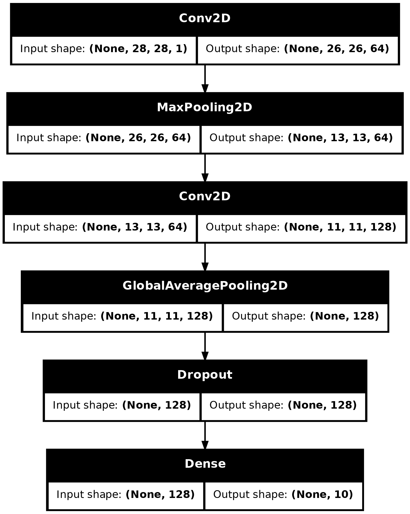

# CNN in Keras

🎯 Implement torch model using CNN based on https://keras.io/getting_started/intro_to_keras_for_engineers/

🛠️ Model Arch

📊 Dataset:

    MNIST from Yann Lecun

🔢 Results:

Terrible, but goal was to implement it for now.

    Accuracy: XX.XX%
    Loss: X.XXX
    Epochs: X

<!-- Training Curve: (Optional, insert training loss/accuracy plot here) -->

🧩 Key Learnings:

    - Keras is framework agnostic which is quite nice.
    - CNNs have what are called channels (Basically how many kernels do you train)
    - You can stack CNN layers but it exponentially increases parameter size
    - Plot grids with a for loop and plt.subplot to visualize data
    - Manipulate label data to make it one-hot categorical

⚠️ Challenges Faced:

    Understanding how to input the correct format, that the metric I was using wasn't the correct one. Tensorboard doesn't seem to want to keep the steps and simply overwrites the batch_step value.

🛠️ Improvements for Tomorrow

    Implement a model using the same method in torch, and using MLFLow.